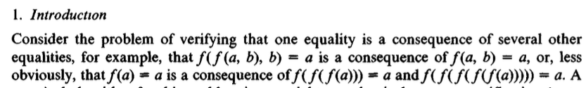
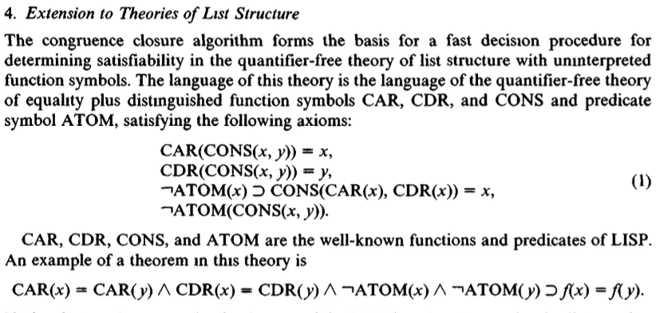

```{post} 2023-12-02

```

# Original Congruence Closure Paper

_In this post, I re-create the examples from the original 1980 paper defining the "congruence closure" of a graph in Python._

## Background

Over the past few days, I have been learning more about the differences in egglog between equality based types
and primitive values (see [issue](https://github.com/egraphs-good/egglog/issues/298) and [pr](https://github.com/egraphs-good/egglog/pull/309)).

It got me thinking more about the core e-graph data structures and so I spent today finally taking a look at
some of the papers [Talia Ringer reccomended](https://github.com/saulshanabrook/saulshanabrook/discussions/27#:~:text=Licata%20at%20Wesleyan-,Talia%20Ringer,-I%20was%20talking)
from the [e-graph week of their proof automation class](https://dependenttyp.es/classes/fa2022/readings/17-egraphs.html), which include:

- ["Congruence Closure in Intensional Type Theory" by Daniel Selsam and Leonardo de Moura in 2016](https://arxiv.org/pdf/1701.04391.pdf) on congruence close with dependent types.
- ["Congruence Closure in Cubical Type Theory" by Emil Holm Gjørup and Bas Spitters](https://cs.au.dk/~spitters/Emil.pdf) as a follow up on the above to adapt it to cubical type theory.
- ["Cubical methods in homotopy type theory and univalent foundations" by Anders Mörtberg in 2021](https://www.cambridge.org/core/journals/mathematical-structures-in-computer-science/article/cubical-methods-in-homotopy-type-theory-and-univalent-foundations/ECB3FE6B4A0B19AED2D3A2D785C38AF9) as an introduction to cubical type theory.

In the first sentance of the intro of the first paper it introduces the concept of "congruence closure" as important for program verification:

> Congruence closure procedures are used extensively in automated reasoning,
> since almost all proofs in both program verification and formalized mathematics
> require reasoning about equalities [23].

I went to follow that citation and read the original paper [**"Fast decision procedures based on congruence closure"** by Nelson and Oppen in 1980](https://dl.acm.org/doi/10.1145/322186.322198).

It was fun to see the original definitions of the congruence closure and to see what problems they were using it to solve.

In this post, I thought it would be cool to re-create the examples using the `egglog` library in Python. We won't get into the looking at how to implement the core algorithms, feel free to refer to the paper for those, but just to use the library
to help give us a visual and tactile feel for how the structures work.

It's nice to see that the concepts from the paper map very closely to the interface of the library, which I think is a testamont to the design of the abstractions in the underlying [`egglog` rust library](https://github.com/egraphs-good/egglog).

## "3. The Quantifier-Free Theory of Equality"

Again, if take a look at just the first sentance of the paper, it gets straight to the point:



Let's see if we can encode this in `egglog`. Since it is strongly typed, we have to defined a dummy type `T` to represent the type of all terms. Since all functions need a fixed number of args, we have to define two functions `f` which takes
two args and `f1` which takes one arg:

```{code-cell} python
from egglog import *


class T(Expr): pass

a = constant("a", T)
b = constant("b", T)

@function
def f(x: T, y: T) -> T: pass

@function
def f1(x: T) -> T: pass
```

Now we can get started trying to prove the examples.

First, we can start by trying to prove that `f(a, b) = a` implies `f(f(a, b), b) = a`:

```{code-cell} python

egraph = EGraph()
# start with our initial assumption
egraph.register(
    union(f(a, b)).with_(a)
)
# Verify that we can prove the result
egraph.check(
    eq(f(f(a, b), b)).to(a)
)
egraph.display()
```

One way to visually prove this is to see that `a` is in the same equivalence class (shows up as a cluster around multiple nodes in the graph) as `f(f(a, b), b)`, if we follow the arguments of `f`, the first is self referential to the same e-class, so we can follow it once more to get to a `f(f(a, b), b)` node.

The second example is a bit more interesting. We can display the e-graph twice. Once after adding the first assumption `f(f(f(a)))` and then again after adding the second assumption `f(f(f(f(f(a)))))`:

```{code-cell} python

egraph = EGraph()
egraph.register(
    union(f1(f1(f1(a)))).with_(a),
)
egraph.display()
egraph.register(
    union(f1(f1(f1(f1(f1(a)))))).with_(a),
)
egraph.check(eq(f1(a)).to(a))
```

We see that now `f(a)` is in the same e-class as `a` and so we can prove that `f(a) = a`.

I really enjoy how by converting these equivalence into these graphical forms makes proving equivalences about them intuitive and visual.

## "4. Extension to Theories of List Structure"

Now lets take a look at the second use case it outlines, which is to be able to prove properties about lists:



Again we start be definying our required functions:

```{code-cell} python
@function
def cons(x: T, y: T) -> T: pass

@function
def car(x: T) -> T: pass

@function
def cdr(x: T) -> T: pass

@function(default=Unit())
def not_atom(x: T) -> Unit: pass
```

The funny one out of the bunch is the `not_atom` function. In `egglog` we represent a function that is just a fact
as one that returns the `Unit` type. We can also call it a "relation". It doesn't return anything meaningful, but just its existinace in the graph gives us information about its arguments.

In this case, we also have certain axioms about our functions:

```{code-cell} python
@ruleset
def list_axioms(x: T, y: T, z: T):
    # CAR(CONS(x, y)) = x
    yield rewrite(car(cons(x, y))).to(x)
    # CDR(CONS(x, y)) = y
    yield rewrite(cdr(cons(x, y))).to(y)
    # ¬ATOM(x) ⊃ CONS(CAR(x), CDR(x)) = x
    yield rule(not_atom(x)).then(union(cons(car(x), cdr(x))).with_(x))
    # ¬ATOM(CONS(x, y))
    yield rule(eq(z).to(cons(x, y))).then(not_atom(z))
```

The first two are quite simple, we can rewrite a more complex term into a simpler one.

The third, requires us to the more powerful `rule` construct (which `rewrite` ends up compiling into) to say that if we know that `x` is not an atom, then we can add the fact that `x` is a `cons` of its `car` and `cdr`.

The fourth is similar, saying that if we find term that is a `cons` of two terms, then we know that term is not an atom.

Now we can actually try to prove the example theorum. First we start with its assumptions:

```{code-cell} python
x = constant("x", T)
y = constant("y", T)

egraph = EGraph()
egraph.register(
    # CAR(x) = CAR(y)
    union(car(x)).with_(car(y)),
    # CDR(x) = CDR(y)
    union(cdr(x)).with_(cdr(y)),
    # ¬ATOM(x)
    not_atom(x),
    # ¬ATOM(y)
    not_atom(y),
)
```

Then we can step-by-step run the rules until we can check for our result and prove it:

```{code-cell} python
egraph.display()
egraph.run(list_axioms)
egraph.display()
egraph.run(list_axioms)
egraph.display()
egraph.check(eq(x).to(y))
```

We can see that it start by running the rule `¬ATOM(x) ⊃ CONS(CAR(x), CDR(x)) = x` on both `x` and `y` since both are not atoms. It unions each with the `cons` of their `car` and `cdr`.

Then it runs the `CAR(CONS(x, y)) = x` and `CDR(CONS(x, y)) = y` rules to unify x and y!

## Conclusion

I had fun translating these examples into `egglog`. I also took a look over the other paper mentioned in the begining and might write about those in a future post. They were obviously more complex, and I understand less of them, since they are about dependent types and cubical type theory. However, it was interesting to see the connetion between things like the theory of the univalance axiom and questions like formalizing the equivalence of different programming languages abstractions. I really enjoyed [Voevodsky's lectures on the foundation of mathematics](https://www.math.ias.edu/vladimir/lectures#:~:text=Foundations%20of%20mathematics%20%2D%20their%20past%2C%20present%20and%20future) intuitiavely it seems like the perspective of treating equivalence as a path seems like an interesting approach. Also, I can see how it relates to open questions of storing proofs of equivalences in egglog as well as how to think about the "directionality" of a equality relational more intentionally, as the addition of features like `merge` functions in `egglog` allow.
