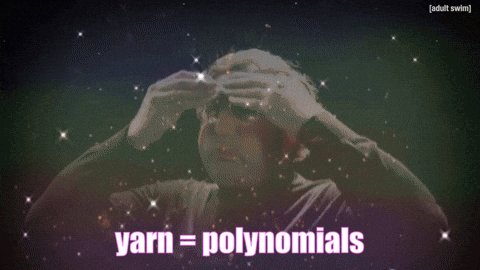

```{post} 2026-03-13
```

# Custom Data Structures in E-Graphs

*Cross-posted on the [UW PLSE blog](https://uwplse.org/2026/02/24/egglog-containers.html).*

[E-graphs](https://en.wikipedia.org/wiki/E-graph) are a data structure used to reason about program equivalence.
Combined with specialized algorithms they can be used to build optimizers or compilers. However,
their performance can struggle as the number of equivalent expressions explodes if we include on algebraic identities, such as
associativity, commutativity, and distributivity (A/C/D).

Alternatively we can attempt to build these identities into our underlying data structure, such as Philip Zucker's explorations of
[Gröbner basis](https://www.philipzucker.com/multiset_rw/) and [bottom up e-matching](https://www.semanticscholar.org/paper/Omelets-Need-Onions%3A-E-graphs-Modulo-Theories-via-Zucker/b07bdef17fdbb7cf927a5a844fc587335864e89a).
For example, instead of representing a sequence of additions as say a tree of binary operations, we can instead represent it as a sorted list of terms being added
or a multiset mapping terms to their counts.
However, building entirely new e-graph systems to take advantage of this is a large engineering lift and splits the ecosystem of users,
reducing the possibility for code reuse between project that use e-graphs.

Here, I explore how supporting custom data structures and higher order functions can
be used to build efficient algebraic representations without changing the internals of an e-graph system.

## EGraphs in Egglog

In this post we will be using, an e-graph framework built on top of a custom database. It's written in
[Rust](https://github.com/egraphs-good/egglog) with [bindings in Python](https://github.com/egraphs-good/egglog-python),
which I will be using here.

First we start with an example where we define a language through a set of types, uninterpreted functions, and rewrite rules
to define equivalences between expressions.

This lets us check things like if `2 * (x + 3) == 6 + 2 * x`, given distributivity and commutativity, along with constant folding rules:

```{code-cell} python
from __future__ import annotations

from egglog import *

# 1. Create a custom type
class Num(Expr):
    # 2. Define constructors for this type from an integer,
    # string, binary addition or multiplication
    def __init__(self, value: i64Like) -> None: ...

    @classmethod
    def var(cls, name: StringLike) -> Num: ...

    def __add__(self, other: Num) -> Num: ...

    def __mul__(self, other: Num) -> Num: ...


# 2. Define a set of rewrite rules that add equivalences
# They work by finding an expression that matches the LHS
# modulo the variables, then adding the RHS with the variables
# substituted, and setting them as equivalent to it
@ruleset
def comm_dist_fold(a: Num, b: Num, c: Num, i: i64, j: i64):
    # commutativity
    yield rewrite(a + b).to(b + a)
    # distributivity
    yield rewrite(a * (b + c)).to((a * b) + (a * c))
    # constant folding
    yield rewrite(Num(i) + Num(j)).to(Num(i + j))
    yield rewrite(Num(i) * Num(j)).to(Num(i * j))


# 3. Create an empty e-graph
egraph = EGraph()

# 4. Add our two initial expressions
expr1 = egraph.let("expr1", Num(2) * (Num.var("x") + Num(3)))
expr2 = egraph.let("expr2", Num(6) + Num(2) * Num.var("x"))


# 5. Run this ruleset until it is "saturated"
# meaning that further application will be no-ops
# as well as output a visualization showing the progress
egraph.saturate(comm_dist_fold)
# 6. Verify that our two expressions are now equivalent
egraph.check(expr1 == expr2)
```

The visualization shows the final state of the e-graph and allows us to step through it using the slider at the top:

The arrows points a function to its arguments. When two expressions are equivalent they are placed in the same cluster,
called an e-class. The top e-class has labels `expr1` and `expr2` in it, meaning they are equivalent now.

By dragging the top slide slider to the left it will show the initial state, before any of the rules were run,
when it just contains our two initial expressions. They are start in different e-classes, since we don't they are equal
until we run our rules. As you drag the slider to the right, you will see the state of the e-graph after each rule application.

EGraphs can also be used for program optimization. By choosing a cost model, for example based on the total number of terms,
we can try to find an expression equivalent to our initial expression and extract it out.

This is comparable to how term rewriting system can also be used for optimization or transformation. One way to look at
egraphs is as if we have use a term rewriting system but we remember all the previous terms we have encountered, and defer
picking the "best' one till the end.
This lets us focus less on rule application order, but it does mean that our memory will increase over time, which
is what we will get to soon.

For a more thorough introduction, check out the [egglog tutorial](https://egglog-python.readthedocs.io/latest/tutorials/tut_1_basics.html),
and for an example of how it can be used inside of a larger system see the [Numba v2 mini book](https://numba.pydata.org/numba-prototypes/sealir_tutorials/index.html).
More examples are collected [in the awesome e-graphs repo](https://github.com/philzook58/awesome-egraphs).
EGraphs also have [an active community](https://egraphs.org/) around them that [chat online](https://egraphs.zulipchat.com/) and
[meet in person](https://egraphs.org/workshop/).

## Size Blow Up

While e-graphs are powerful, they can "blow up", increasing in size drastically even when starting with small expression.
For example if we start with `2 + a + b + b + 3` and add A/C/D rules we can see it increase in size:

```{code-cell} python
@ruleset
def assoc(a: Num, b: Num, c: Num):
    yield birewrite(a + (b + c)).to((a + b) + c)


egraph = EGraph()
a, b = Num.var("a"), Num.var("b")
new_expr = egraph.let("new_expr", Num(2) + a + b + b + Num(3))

# run both the associativity and commutativity/distributivity
# rules together
egraph.saturate(assoc | comm_dist_fold)
egraph.extract(new_expr)
```

As the number of e-nodes increases so does the memory usage and also the runtime, limiting the ability
to use these kinds of rules on large expressions. One way to work around this
is to limit the number of times we apply certain rules or limit the size of e-graphs, with the tradeoff that this
limits the size of our search space. What if instead we could maintain
an optimization like constant folding without an increasing blow-up size due to the other rules?

We will look at how containers can be used to achieve this, but first some background on how Egglog handles primitives.

## Primitives and Containers in Egglog

Along with Egglog letting you define your own types, like `Num`, it also comes with a number of builtins/primitives like `i64` and `String`.
The core comes with a number of them, but they can also be written in Rust extensions as plugins. To define a new type in Rust
you must define how to compare them with equality and how to hash them.
Primitives are treated like opaque values, Egglog doesn't reason about their inner structure. Functions can also be defined
over primitives, again either in the core or as a Rust extension. Egglog doesn't know anything about their semantics, just that
they take in primitives and return other primitives.

If we think of primitives as opaque values, what if we want to contain a primitive inside of another one? For example,
a `Vec` type that contains a number of items. To define such a type in Rust, we need the above properties around hashing
and equality, but we also need to make sure it respects congruence. Congruence is the property where if you have
two expression `f(a)` and `f(b)` in the e-graph, and then you make `a == b`, then `f(a)` should also equal `f(b)`. We want
this same property to hold for something like a vector, so if you have `Vec(a, c)` and `Vec(b, c)` in the e-graph, and you make `a == b`,
then these two vecs should also be equal `Vec(a, c) == Vec(b, c)`.

We do this by implementing one additional operation on containers, rebuilding. This is called whenever we want to renormalize
the e-graph to preserve congruence. We defer it so we don't do it after every union operation, to reduce the amount of work.
Since containers "contain" references to other e-classes, we need to update those references. That what this rebuilding
operation does, so that when its time to rebuild, the `Vec` type calls rebuilding on each of its inner values, updating them with
new names for each e-class.
So then when we check for equality after that, it will preserve congruence.

Egglog doesn't know anything more about the structures of containers besides how to rebuild them and any primitive functions you define on them.
This both makes them relatively easy to implement and add, but also limits the ability to "match" over them, which will see how to work around
in the next section.

One use case for containers is to represent operations with more structure. I the above, we have defined
addition as a binary operation with two ordered arguments. However, we may decide that for our use case,
we not only wanna make `a + b` equal to `b + a`, but in fact indistinguishable. This effectively
replaces the commutative and associativity rules with instead a representation that maintains their invariants.
One way we could do that is with a container that represents all terms being added.
This would be a [multiset aka bag](https://en.wikipedia.org/wiki/Multiset), since
we want to know how many times a term is being added, but we don't care about the order.

We can write this in the Python bindings like so:

```{code-cell} python
@function
def sum_(xs: MultiSet[Num]) -> Num: ...
```

Now if we construct `sum_(MultiSet(a, b))` this will be equal to `sum_(MultiSet(b, a))` due to the implementation of multiset b
being order insensitive:

```{code-cell} python
egraph = EGraph()
x = Num.var("x")
y = Num.var("y")
z = egraph.let("z", sum_(MultiSet(x, y)))
egraph.check(z == sum_(MultiSet(y, x)))
```

We have the rebuilding property we talked about above as well, to maintain congruence. If we now union `x` with `y`,
the sum will reflect this to become `sum_(MultiSet(x, x))`:

```{code-cell} python
egraph.register(union(x).with_(y))
egraph.check(z == sum_(MultiSet(x, x)))
```

So we can see here we can represent a whole set of equal summations only with one multiset, instead of having to add
many terms to the e-graph.

## Matching on Containers by Index

Given this new implementation, how would we replicate the above constant folding example on it?

Well first we can start by creating a new e-graph and adding the expression, this time using our `sum` function with multisets,
instead of binary addition:

```{code-cell} python
egraph = EGraph()
new_expr = egraph.let("new_expr", sum_(MultiSet(Num(2), a, b, b, Num(3))))
```

One way to think about a constant folding rule would be to  "Look for a sum that contains two constant numbers,
take them both out and add their sum back in". However, we don't have the ability to match on the contents of a multiset directly,
since as we said above Egglog doesn't know anything about its inner structure.

One way we can work around this is to build up an "index" function for the contents of the multiset. This maps
a multiset and an item inside of it, to the count of times it shows up in that multiset:

```{code-cell} python
@function
def ms_num_index(xs: MultiSet[Num], x: Num) -> i64: ...
```

It is similar to in a database if you need to do a join efficiently you have to build an index.

Then we can add two rules, one that fills in the index whenever we have a sum and then another one that matches on that
to do the constant folding:

```{code-cell} python
@ruleset
def constant_fold_index(xs: MultiSet[Num], i: i64, k: i64):
    # For all sums, fill in the index function
    yield rule(sum_(xs)).then(xs.fill_index(ms_num_index))

    # Try replacing any sum with the folded version
    yield rewrite(sum_(xs)).to(
        # Replace the two numbers with their sum, by removing
        # them and then inserting their sum back in
        sum_(xs.remove(Num(i)).remove(Num(k)).insert(Num(i + k))),
        # These are conditions for the rewrite to match:
        # Look for a multiset that contains two numbers that
        # are not the same one
        ms_num_index(xs, Num(i)),
        ms_num_index(xs, Num(k)),
        i != k,
    )


egraph = EGraph()
new_expr = egraph.let("new_expr", sum_(MultiSet(Num(2), a, b, b, Num(3))))
egraph.saturate(constant_fold_index)
egraph.extract(new_expr)
```

If we run this now we can see that we get back out the folded expression, without the blow-up from before:

However, we still add a number of nodes to the e-graph to maintain the index. While this works in this small example,
if many intermediate multisets are generated, this can lead again to a blow-up in the e-graph size.

So what if instead there was a way to express this rule without needing to maintain this index?

## Matching on Containers with Higher Order Functions

We can look at the rule above as trying to pull out two numbers from a sum and fold them in together. So if there were `n`
constants, it would trigger `n * (n - 1)` times, since we can choose any two of them to fold together. What if instead
we wanted to express a rule that selects *all* constants from a multiset and folds them together?

The index approach won't work here, because we don't have a fixed number to match on. Instead, we can use higher order functions
to express this as a block wise operation. Effectively we want to say "Pull out all constants in the multiset, add them together,
and then add that back into the multiset with all the non-constants".

But first we need to add a helper function that returns an `i64` for a `Num` if its a constant:

```{code-cell} python
@function
def get_i64(x: Num) -> i64: ...


@ruleset
def set_get_i64(i: i64):
    yield rule(Num(i)).then(set_(get_i64(Num(i))).to(i))
```

Then we can define the constant folding, using higher order `fold` and `map` operations

```{code-cell} python
@ruleset
def constant_fold_sum(xs: MultiSet[Num]):
    # Extract out all the constants from the sum
    constants = xs.map(get_i64)
    # Filter for the remaining values that are not constants
    remaining = xs - constants.map(UnstableFn(Num))
    # Sum all the constants to fold them together
    folded = multiset_fold(i64.__add__, i64(0), constants)
    yield rewrite(sum_(xs)).to(
        # replace it with the non constants plus the folded
        sum_(remaining.insert(Num(folded))),
        # Only run this rule if there are more than one
        # constant to fold together
        constants.length() > 1,
    )


egraph = EGraph()
new_expr = egraph.let("new_expr", sum_(MultiSet(Num(2), a, b, b, Num(3))))
egraph.saturate(set_get_i64.saturate() + constant_fold_sum.saturate())
egraph.extract(new_expr)
```

Running the setting ruleset first, then the folding ruleset,
we can see that we get the same result as before,but without needing to maintain the index:

Using higher order functions on containers, we can express efficient rewrite rules
that reduce the size of the e-graph compared to using binary operations. The container themselves preserves some of the core
identities that would lead to blow up, and the higher order functions support block wise operations to process an
arbitrary number of items as once.

For a larger example that motivated this work, see the case study in Appendix 1, where we have a large polynomial expression with many terms that
we want to factor. That case study also demonstrates how we can convert from binary operations into containers as well. In the Appendix 2,
there are a few more examples that we could apply this approach to as well.

## Takeaways

Experimenting with using containers in this way explores how we can add more efficient representations in e-graphs
to an existing system like Egglog, by using custom data structures.

It's also interesting that these representations can be not only more efficient but also more directly correspond
to the semantics of the your use case, compared to say a tree of binary operations.

This work also highlights some of the current limitations of egglog.

One issue is that composing functions of primitives is currently very limited. The only tool we have is currying, but
it is not possible to reorder arguments or compose them in more complicated manners. This inevitably leads to
creating more bespoke functions. For example, I had to add a `multiset_contains_swapped` function that swaps the order
of the `contains` method, since I needed to partially apply it with the second argument. Further exploring this line of
work might lead to trying out different ways of enriching primitive functions, possibly by allowing a way at runtime
to create new ones by composing others, either through a DSL/JIT or a higher order composition approach like the
[compiling to categories](http://conal.net/papers/compiling-to-categories/) work.

Implementing these higher order functional primitives on containers is also challenging, due to the lack of built-in
generic type support in Egglog. Adding them currently is fiddly and requires careful thought over how to implement
their generic types. Adding built in support for generic types, both in primitives and user code, could make this more
scalable.

Overall, I hope that this work shows that there is a design space here in Egglog to try out different
ways of representing new normalized forms of different domains and then designing algorithms over them. As opposed to
creating a whole new e-graph implementation, adding them as custom containers to Egglog supports reuse of the existing
engineering work and compositionality within the ecosystem. I am left wondering how further improvements to Egglog
can help extend this type of experimentation of how to efficiently represent different domains inside of e-graphs.

## Appendix 1: Case Study from a Cloth Simulation Workload

Here we start with an expression from the paper ["Interactive design of periodic yarn-level cloth patterns"](https://www.semanticscholar.org/paper/Interactive-design-of-periodic-yarn-level-cloth-Leaf-Wu/6350d7feb2dfc37d434da2839eacd5e8b025edda),
which is part of a larger program that does cloth simulation. It was recommended by my advisor, [Gilbert Bernstein](http://www.gilbertbernstein.com/),
since we can use their reference implementation in Mathematica to verify that our implementation matches theirs.



*Note that all code for this case study is reproducible in [this notebook](https://github.com/egraphs-good/egglog-python/blob/270a1876b6dbea37e441c132adbfdc8c11cbb319/docs/explanation/2026_02_containers_code.ipynb).*
*It is currently based on a branch of the Python bindings and Rust source, that adds additional multiset operations.*
For this docs version, the notebook content is reproduced later in this page in a folded appendix block.

We define define a function to produce the amount of bending for a certain point over the [Python Array API Specification](https://data-apis.org/array-api/latest/API_specification/),
so that it works on both concrete NumPy arrays and symbolic arrays. It takes in a number of 1D arrays and returns a 0D array.
The details of what each argument represents and the underlying semantics are not important to this example, but our main objective
would be for a graphics researcher to be able to prototype a function like this. Then we would want our system
to "optimize" it in some way, before compiling it to something like CUDA to run on a GPU:

```{code-cell} python
def bending_function(Q, Bp, Bpp):
    xp = Q.__array_namespace__()
    QM = xp.reshape(Q, (4, 3)).T

    yip = xp.vecdot(QM, Bp)
    yipp = xp.vecdot(QM, Bpp)
    num = xp.linalg.vector_norm(xp.cross(yip, yipp))
    den = xp.linalg.vector_norm(yip) ** 3
    return (num / den) ** 2
```

We symbolically evaluate the result of this function by using [an implementation of the Array API written in Egglog](https://github.com/egraphs-good/egglog-python/blob/cb263b163150181d164db25fbbac6e8a1e2da719/python/egglog/exp/array_api.py):

```{code-cell} python
import egglog
import egglog.exp.array_api as enp

Bp = enp.NDArray([enp.Value.var(f"bp{i}") for i in range(1, 5)])
Bpp = enp.NDArray([enp.Value.var(f"bpp{i}") for i in range(1, 5)])
Q = enp.NDArray([enp.Value.var(f"q{i}") for i in range(1, 13)])
FunctionBending = enp.NDArray(bending_function(Q, Bp, Bpp).eval())
FunctionBending
```

We can also compute its gradient with respect to `Q`, to give us an even larger expression.

```{code-cell} python
GradientBending = enp.NDArray(FunctionBending.diff(Q).eval())
```

Calling `eval` here will create the necessary e-graph with rewrites, add the expression, and reduce it to a simplified
form that only contains a rational expression with polynomial subexpressions.

For the sake of this example, let's first fully "distribute" the polynomial we have. This means expanding it into a normal
form, by applying the distribute rule, so that `a(x + y)` becomes `ax + ay`. This is meant to simulate a worst-case scenario,
since the cost increases as we distribute, duplicating terms. This suffices to give us a large enough example to stress test our system:

```{code-cell} python
@egglog.ruleset
def remove_subtraction(a: enp.Value, b: enp.Value):
    yield egglog.rewrite(a - b, subsume=True).to(a + (-1) * b)


@egglog.ruleset
def distribute(a: enp.Value, b: enp.Value, c: enp.Value):
    yield egglog.rewrite((a + b) * c, subsume=True).to(a * c + b * c)
    yield egglog.rewrite(c * (a + b), subsume=True).to(c * a + c * b)
```

```{code-cell} python
:tags: [hide-output]
egraph = egglog.EGraph()
egraph.register(FunctionBending)
egraph.run(remove_subtraction.saturate() + distribute.saturate())
FunctionBending_distributed = egraph.extract(FunctionBending)

gradient_egraph = egglog.EGraph()
gradient_egraph.register(GradientBending)
gradient_egraph.run(remove_subtraction.saturate() + distribute.saturate())
GradientBending_distributed = gradient_egraph.extract(GradientBending)
FunctionBending_distributed
```

We now have an expression that is mainly a sum of products, a multivariate polynomial.

For some sense of their size, the `FunctionBending` has initial cost of 401 and the `GradientBending` has 20,570.
This cost is produced by the Egglog extractor, corresponding roughly to one node per op like `*` and one per variable as a tree.
This is meant to reflect roughly the cost to compute the expression, so a lower an expression with a lower cost would run faster.

One way to lower the cost of a polynomial is to factor it, so that `ax + ay` becomes `a(x + y)`. This is the same as applying the distributivity rule in reverse.
There are however many equivalent factorizations, and some may be better than others.
One way to use egglog to optimize this space would be to add in the associativity, commutativity, and distributivity rules and run it until saturation, and extract
out the lowest cost:

```{code-cell} python
:tags: [hide-output]

@egglog.ruleset
def factoring(a: enp.Value, b: enp.Value, c: enp.Value):
    yield egglog.birewrite((a + b) * c).to(a * c + b * c)
    yield egglog.rewrite(a * b).to(b * a)
    yield egglog.rewrite(a + b).to(b + a)
    yield egglog.birewrite(a * (b * c)).to((a * b) * c)

egraph.run(factoring.saturate())
egraph.extract(FunctionBending_distributed)
```

For the `FunctionBending` example, this works fine, taking about a tenth of a second to saturate and then extract out the smallest one.

However, if we use the `GradientBending`, each iteration will take longer and longer. Cutting it off after 10 second per iteration,
we get through only three of them and the e-graph is not saturated. It will have decreased the cost to 2,126,268 from the original of
4,250,786. However, it will also have increased the number of nodes in the e-graph from 588,125 originally to
2,583,064. This blow is due to the evaluation of associativity and commutativity rules.

The gradient is also only the first derivative of the function bending. In the real workload from the paper,
we also need to compute the second derivative and ideally consider it as part of a larger expression.
So at least if we fully distribute first, trying to naively explore the entire search space of factorization through
associativity, commutativity, and distributivity rules is not really feasible for this type of expression.

### Representing Polynomials with Multisets

Taking a step back, the main space we want to explore here is the different options for factoring the expression. We
don't really care about which expression to pick due to associativity or commutativity since the cost will be the same (at this
point we are not considering common sub expression elimination and constant folding doesn't apply in this example).
We add those rules so that we can explore the space of factorizations through the distributivity rule.

So what if instead we choose to represent a polynomial such that the form is agnostic to ordering or association?
To represent just a product of values, we need a single multiset, storing the exponent of each term as the count of the number times
that expression shows up in the product. For example, the expression `a * b * b` would be represented as the multiset `{a: 1, b: 2}`.
To represent a sum of products (aka a polynomial), we need a multiset of multisets, where each inner multiset is a monomial, and the outer multiset is the sum of these monomials, with the counts holding the multiple of each.
For example, the expression `2 * a * b + 3 * a**2` would be represented as the multiset of multisets `{ {a: 1, b: 1}: 2, {a: 2}: 3}`.

We can add a new function to construct values from this represent:

```python
@function
def polynomial(x: MultiSet[MultiSet[Value]]) -> Value: ...
```

Our first task then is to translate between our binary operations and this multiset form.
The first couple of rules are relatively straightforward, just converting addition, multiplication, and exponentiation to the
corresponding forms, along with saving some analysis on terms that we will use later. This is a one way translation, so
we can also delete the source terms once we match them, so extraction doesn't match them. We create a ruleset to do this translation:

```python
@function(merge=lambda old, new: new)
def get_monomial(x: Value) -> MultiSet[Value]:
    """
    Will be defined on all polynomials with exactly one monomial created in `to_polynomial_ruleset`:

        get_monomial(polynomial(MultiSet(xs))) => xs
    """


@function(merge=lambda old, new: new)
def get_sole_polynomial(xs: MultiSet[Value]) -> MultiSet[MultiSet[Value]]:
    """
    Will be defined on all monomials that contain a single polynomial created in `to_polynomial_ruleset`:

        get_sole_polynomial(MultiSet(polynomial(xss))) => xss
    """

@ruleset
def to_polynomial_ruleset(
    n1: Value,
    n2: Value,
    n3: Value,
    i: i64,
    ms: MultiSet[Value],
    mss: MultiSet[MultiSet[Value]],
    mss1: MultiSet[MultiSet[Value]],
):
    yield rule(
        eq(n3).to(n1 + n2),
        eq(mss).to(MultiSet(MultiSet(n1), MultiSet(n2))),
        name="add",
    ).then(
        union(n3).with_(polynomial(mss)),
        set_(get_sole_polynomial(MultiSet(polynomial(mss)))).to(mss),
        delete(n1 + n2),
    )
    yield rule(
        eq(n3).to(n1 * n2),
        eq(ms).to(MultiSet(n1, n2)),
        name="mul",
    ).then(
        union(n3).with_(polynomial(MultiSet(ms))),
        set_(get_monomial(polynomial(MultiSet(ms)))).to(ms),
        delete(n1 * n2),
    )
    yield rule(
        eq(n3).to(n1**i),
        i >= 0,
        eq(ms).to(MultiSet.single(n1, i)),
        name="pow",
    ).then(
        union(n3).with_(polynomial(MultiSet(ms))),
        set_(get_monomial(polynomial(MultiSet(ms)))).to(ms),
        delete(n1**i),
    )
```

When applying this ruleset we will replace binary operations with multiset values, but they will be unnecessarily
nested. For example, we might end up with a term like `polynomial(MultiSet(MultiSet(polynomial(xs))))`, which should be replaced
with just `polynomial(xs)`. We define two additional rules to cover cases like this:

```python
    yield rule(
        eq(n1).to(polynomial(mss)),
        # For each monomial, if any of its terms is a polynomial with a single monomial, flatten
        # that into the monomial, otherwise keep it as is
        mss1 == mss.map(partial(multiset_flat_map, get_monomial)),
        mss != mss1, # skip if this is a no-op
        name="unwrap monomial",
    ).then(
        union(n1).with_(polynomial(mss1)),
        delete(polynomial(mss)),
        set_(get_sole_polynomial(MultiSet(polynomial(mss1)))).to(mss1),
    )
    yield rule(
        eq(n1).to(polynomial(mss)),
        # If any of the monomials just has a single item which is a polynomial, then flatten that into the outer polynomial
        mss1 == multiset_flat_map(UnstableFn(get_sole_polynomial), mss),
        mss != mss1,
        name="unwrap polynomial",
    ).then(
        union(n1).with_(polynomial(mss1)),
        delete(polynomial(mss)),
        set_(get_sole_polynomial(MultiSet(polynomial(mss1)))).to(mss1),
    )
```

We have avoided the need to match inside of containers by instead using higher order functions to apply blockwise
operations that are executed in Rust during rule matching. We had to create the above analysis for the same reason,
we cannot create functions whose implementation is deferred until a later rewrite, they must be available at match time.

After running these rulesets any subexpressions that contain only additions and multiplications will be turned into
flattened multisets, which is what we wanted to do in this section.
What's nice here is also if there are any other operations defined like `/`, this will work transparently
with them, making this type of analysis extensible as the system grows, since we only normalize polynomial subtrees. The
contents of their terms don't have to be limited to integers and variables:


```{code-cell} python
:tags: [remove-input]

polynomial_egraph = egglog.EGraph()
polynomial_egraph.register(FunctionBending_distributed)
polynomial_egraph.run(enp.to_polynomial_ruleset.saturate())
FunctionBending_polynomial_multisets, FunctionBending_polynomial_multisets_cost = polynomial_egraph.extract(
    FunctionBending_distributed,
    include_cost=True,
)
print(FunctionBending_polynomial_multisets_cost)
FunctionBending_polynomial_multisets
```

### Greedy Multivariate Horner Factorization

Now that we have our polynomial subterms represented as nested multisets, the next step here is to see if we can find a form
with lower cost. One of the ways to do this with polynomials is to try to find a factorization of them that minimizes the number
of multiplications. With univariate polynomials, we can use an optimal algorithm called [Horner's method](https://en.wikipedia.org/wiki/Horner%27s_method).
Extending this to multivariate polynomials, there isn't an efficient algorithm that is guaranteed to produce the optimal factoring, but
there is [a greedy algorithm that will often produce a good one](https://www.semanticscholar.org/paper/Greedy-algorithms-for-optimizing-multivariate-Ceberio-Kreinovich/96103f6f48bd15d40de43a716922d1177b2b5ea2).

So instead of considering all possible factorizations and then waiting till extraction to pick out the best one,
we can try to implement this greedy algorithm. This is made easier by the fact that we have flattened the polynomial
into a multiset of multisets, so we can analysis it holistically.

To implement this, we find the factor that shows up in the most monomials, then find the subset of monomials which contain it, take
the intersection of all of those (to find the largest factor we can pull out of all of them), factor that out, and add it to the remainder
that didn't include that factor:

```python
@ruleset
def factor_ruleset(
    n: Value,
    mss: MultiSet[MultiSet[Value]],
    counts: MultiSet[Value],
    picked_term: Value,
    picked: MultiSet[MultiSet[Value]],
    divided: MultiSet[MultiSet[Value]],
    factor: MultiSet[Value],
    remainder: MultiSet[MultiSet[Value]],
):
    yield rule(
        eq(n).to(polynomial(mss)),
        # Find factor that shows up in most monomials, at least two of them
        counts == MultiSet.sum_multisets(mss.map(MultiSet.reset_counts)),
        eq(picked_term).to(counts.pick_max()), # on ties pick an arbitrary one
        # Only factor out if it appears in more than one monomial
        counts.count(picked_term) > 1,
        # The factor we choose is the largest intersection between all the monomials that have that that factored term
        picked == mss.filter(partial(multiset_contains_swapped, picked_term)),
        factor == multiset_fold(MultiSet.__and__, picked.pick(), picked), # intersection
        divided == picked.map(partial(multiset_subtract_swapped, factor)),
        # remainder is those monomials that do not contain the factor
        remainder == mss.filter(partial(multiset_not_contains_swapped, picked_term)),
        name="factor",
    ).then(
        # factor * polynomial(divided) + remainder
        union(n).with_(polynomial(MultiSet(factor.insert(polynomial(divided))) + remainder)),
        delete(polynomial(mss)),
    )
```

If we apply this, we now have a factored form! We can see that this uses a similar technique to above, where we use higher order functions
to create a new polynomial based on the old one, and replace it.

```{code-cell} python
:tags: [remove-input]

polynomial_egraph.run(enp.factor_ruleset.saturate())
FunctionBending_polynomial_multisets_factored, FunctionBending_polynomial_multisets_factored_cost = polynomial_egraph.extract(
    FunctionBending_polynomial_multisets,
    include_cost=True,
)
print(FunctionBending_polynomial_multisets_factored_cost)
FunctionBending_polynomial_multisets_factored
```

We can then turn this multiset form back into one with binary operations, giving us an end-end-end way to factor polynomials
in Egglog without exploring the full A/C/D space, reducing the size blowup.

For the smaller expression of the bending function, this produces a result of the same cost as the full factorization
and takes half the time. It also produces many fewer nodes. While the full factored version has 13,040 in the e-graph,
this one only has 927, which is only slightly more than the original size after distributing (904 nodes).

For the larger expression, of the gradient, the difference is even starker. This approach is able to factor it to a cost of 79,974,
whereas we stopped the full factorization after it reached 2,125,338. In terms of e-graph size we have 112,144 nodes at the end
compared to the 2,582,934 of the full factorization.

So overall, this example shows a way to do a directed factorization to reduce the total cost of an expression,
without having to explore the full space of equivalent expressions. While this isolated use case might not be a good
fit for e-graphs, inside of a larger optimization pipeline this shows how we can capture this type of optimization in
a way that is composable.

Moreover, it is an experiment in how we can build rules on top of containers that use higher order functions
to do more complicated analysis, without leading to a node blow up.

## Appendix 2: Further Examples

Above I presented a large example that comes from my current line of research. However, there are many
smaller examples that could also be used to explore the usefulness of this kind of technique. Due to limitations in my time
I haven't explored these deeply, but did want to mention them.

[Yihong](https://effect.systems/) shared with me an example of how just having a simple associativity rule and a rule for multiplying by zero will lead
to never saturating:

```clojure
(datatype Int (mul Int Int) (a) (zero))

(birewrite (mul x (mul y z)) (mul (mul x y) z))
(rewrite (mul (zero) x) (zero))

(mul (zero) (a))
(run-schedule (repeat 8 (run)))
```

Instead, if we represented this as a product of a multiset, we could simply have a rule that looked for a zero element
in the multiset and replaced that with zero. Then there would be no associativity needed, and so no chance for this to blow up. A `product(MultiSet(...))`
operation can handle associativity and commutativity and the rebuilding handles merges.

When I asked on the EGraph's Zulip for more examples, Sophia B also [shared another example with me](https://egraphs.zulipchat.com/#narrow/channel/328972-general/topic/A.2FC.20Blowup.20Example/near/573091425). If you have the rule `f(a + b) + 1 = f(a) + f(b)` plus A/C, you can derive equalities like `f(x) + (f(y) + f(z)) = f(x + (y + z)) + 2`, but it can take a large number of nodes.
Instead in this system, we would have to encode that rule over multisets and add constant propagation to the sum function, to see how it could be found more directly, through normalization.

*I [used an LLM](https://chatgpt.com/share/69969a20-26d4-8011-879a-62a04adfed31) to get feedback on the draft and revised based on its suggestions to improve readability, organization, and consistency.*
*Thank you Oliver, Yihong, Gilbert and Alexandra also who gave feedback to me throughout this process and while drafting this post.*
